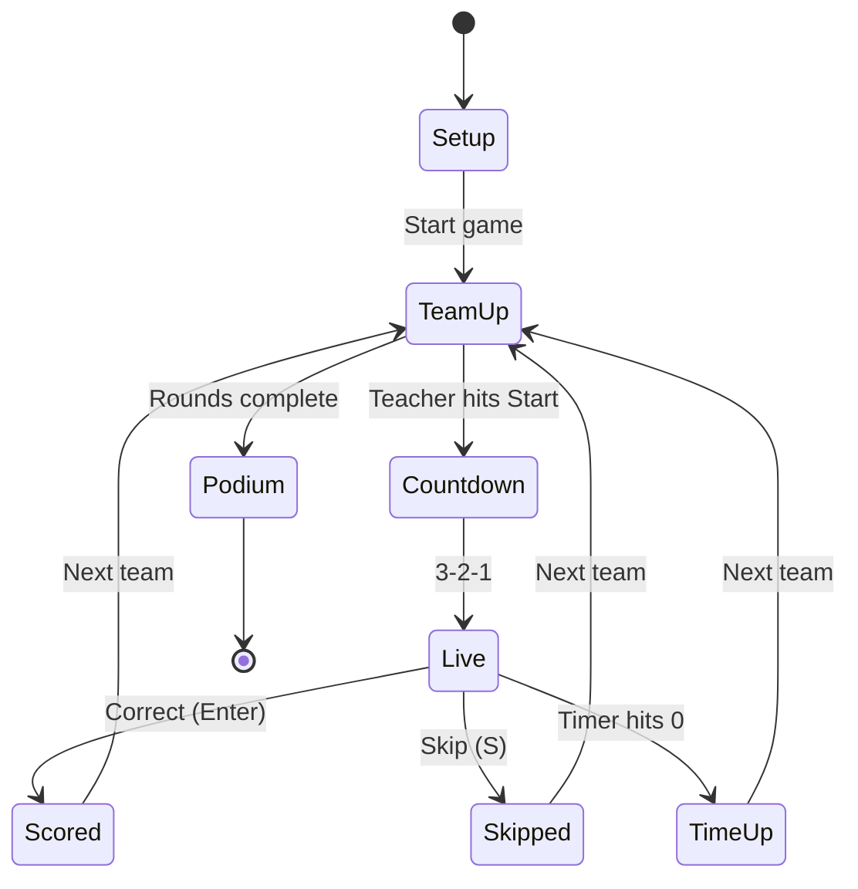

# Classroom Password Game PRD

## 2. How the game runs

One screen runs on the classroom projector. The teacher controls everything from the keyboard or a few big buttons. One student per turn is the guesser and stands facing the class with their back to the screen. Their teammates see the word on the screen and shout one-word clues. Clues cannot be the word, contain the word, or be an obvious variant of it. If the guesser says the word before the timer ends, the team scores. Then the next team is up.



Setup is where the teacher enters team count and names. TeamUp shows which team and which guesser is next. Live shows the word, the clock, and the score. Podium is the end screen.

A round is one turn for every team. The teacher picks how many rounds a game has. The guesser role rotates within a team, so the app tracks who has already guessed. If a team has 4 players and the game has 8 rounds, each player guesses twice.

## 3. Features

Build everything in the must column before touching the other two. A judge will notice a broken timer long before they notice missing confetti.

| Must have | Should have | Nice to have |
|---|---|---|
| Timer, default 20 s, teacher-set from 5 to 120 s | 3-2-1 countdown before the clock starts | Sound effects: tick in last 5 s, buzzer, correct chime, mute toggle |
| Random word from a bundled list, no repeats within a game | Word filters: syllable count, length, difficulty tier, category | Confetti on correct guess |
| Leaderboard visible on the game screen and on its own screen | Skip word (S key), with a per-turn skip limit the teacher sets | Points bonus for seconds remaining, off by default |
| Set number of teams (2 to 8), name them, assign students | Guesser rotation inside each team, shown on the TeamUp screen | Round history log the teacher can scroll back through |
| Correct (Enter), Skip (S), Pause (Space), Next (N) keyboard controls | Banned clue checker: paste what was said, app says if it broke the rules | Export results as CSV |
| Game state survives a page refresh (localStorage) | Custom word list: teacher pastes their own words | Two-screen mode: teacher's laptop shows controls, projector shows the game |
| Settings screen with sensible defaults, works with zero setup | Reveal word to guesser when time runs out | Dark and light theme |
| Projector-readable: word at 120 px or larger, timer at 200 px or larger | End-of-game podium with 1st, 2nd, 3rd | |

The banned clue checker is the one feature no one else in the competition will think to build. It also answers the part of the rules the teacher has to referee by hand today.

## 4. Screens

Five screens, all in one page app, all reachable in one click from a thin top bar. No page ever requires scrolling on a 1920 by 1080 projector.

| Screen | What it shows | Teacher actions |
|---|---|---|
| Setup | Team count stepper, team name fields, optional student names per team, Start button | Add or remove teams, rename, paste a roster, load last game's teams |
| Team up | Big team name, the guesser's name, current standings on the side, Start Turn button | Start (Space), change guesser, skip this team |
| Live | Word in huge type, circular timer, current team, points this turn, skips left | Correct (Enter), Skip (S), Pause (Space), End turn (Esc) |
| Leaderboard | Ranked teams with points, turns played, correct guesses, a bar per team | Resume game, edit a score by hand, end game early |
| Podium | Top three on blocks, full table under it, Play again with same teams | Play again, New game, Export CSV |

Live screen layout: word centered in the top two thirds, timer as a ring around a large number in the lower left, team name and score in the lower right. Timer ring turns amber at 10 s and red at 5 s. When time runs out the word stays up for 2 s with a Time's up banner so the class sees it.

Settings opens as a drawer from the top bar, never as its own route, so the teacher can change the timer between turns without losing their place.

## 5. Settings

Every setting has a default that makes the game playable with no changes. Settings persist in localStorage and carry over to the next game.

| Setting | Default | Range or options |
|---|---|---|
| Turn length | 20 s | 5 to 120 s, 5 s steps |
| Number of teams | 2 | 2 to 8 |
| Rounds per game | 5 | 1 to 20, or unlimited |
| Syllables | Any | Any, 1, 2, 3, 4+, or a custom range |
| Word length | Any | Any, or min and max letters |
| Difficulty | Medium | Easy, Medium, Hard, Mixed |
| Categories | All | Multi-select: animals, food, objects, places, actions, school, sports, nature, people |
| Skips per turn | 1 | 0 to 3 |
| Points per correct guess | 1 | 1 to 10 |
| Time bonus | Off | Off, or +1 point per 5 s remaining |
| Countdown before turn | On | On, Off |
| Sound | On | On, Off |
| Reveal word on time up | On | On, Off |
| Custom word list | Empty | Paste one word per line; replaces or adds to the built-in list |

A Reset to defaults button sits at the bottom of the drawer.

## 6. Word engine

The word list ships inside the app as one JSON file, built by a script, so the game works offline and loads instantly. Target size is 1,500 to 2,500 words. Every entry carries the word, syllable count, letter count, difficulty tier, and category.

**Building the list.** Claude Code writes `scripts/build-words.ts`. It starts from a hand-curated `words/source.txt` of common, guessable nouns, verbs, and adjectives grouped by category (about 150 to 300 per category). Syllable counts come from the CMU Pronouncing Dictionary: download it in the script, count the vowel phonemes (the ones ending in a stress digit) for each word. Words missing from CMUdict fall back to a vowel-group heuristic and get flagged in the build output so they can be checked by hand. Difficulty comes from a word frequency list (the `wordfreq` package or the Google 10,000 English list): top 3,000 by frequency is Easy, next 7,000 is Medium, the rest is Hard. The script writes `src/data/words.json` and prints counts per syllable, tier, and category so an empty bucket is obvious.

**Picking a word.** Filter the list by the active settings, remove every word already used this game, then pick uniformly at random. If the filtered pool has fewer than 10 words left, the app shows a warning on the Team up screen and widens the filter one step rather than repeating. Words used are stored in game state so a refresh does not reset them.

**Banned clue checker.** The teacher types or pastes a clue the class disputed. The app normalizes both strings (lowercase, strip punctuation) and flags the clue if any of these hold:

1. Clue equals the word.
2. Clue contains the word or the word contains the clue, for words of 4 or more letters.
3. Clue and word share a stem after stripping s, es, ed, ing, er, est, ly.
4. Levenshtein distance between clue and word is 2 or less and the word is 5 or more letters.
5. Clue is one of the word's compound parts (for `sunflower`, both `sun` and `flower` are banned).

Each rule prints its own reason so the teacher can explain the call. Rhymes and translations are allowed unless the teacher adds them to a custom banned list in settings.

## 7. Scoring and leaderboard

A correct guess earns the points-per-guess setting (default 1). A skip earns 0 and uses one of the turn's skips. Time up earns 0. With the time bonus on, a correct guess also earns 1 point per full 5 seconds left on the clock, so a 20 s turn tops out at 4 bonus points. One word per turn by default; a Multi-word mode setting lets the team keep going after a correct guess until time runs out, which is how some classes play it.

The leaderboard ranks by points, then correct guesses, then fewest skips. Ties after that show the same rank. Each row shows rank, team name, points, correct, skipped, and turns played. The teacher can click any score and edit it, with the edit logged in the round history.

The Podium screen shows the top three on stepped blocks with the winner in the middle and tallest. Below it sits the full table and a Play again button that keeps teams and resets scores.

## 8. Tech stack and data model

No backend. The whole app is static files that deploy to GitHub Pages or Vercel in one command, run from a USB stick, or open from a local folder. This is the right call because the classroom may not have reliable Wi-Fi and a judge should be able to open a link and play in under 10 seconds.

| Choice | Pick | Why |
|---|---|---|
| Framework | Vite + React + TypeScript | Fast dev loop, one build command, Claude Code knows it well |
| Styling | Tailwind CSS | Quick to get projector-sized type right; no design system needed |
| State | Zustand store with a `persist` middleware to localStorage | One store for game, settings, and history; survives refresh for free |
| Routing | React Router, hash mode | Hash routes work on GitHub Pages without server config |
| Timer | `requestAnimationFrame` against a start timestamp | `setInterval` drifts and pauses in background tabs |
| Sounds | Web Audio API, synthesized tones | No audio files to license or load |
| Tests | Vitest for the word engine, clue checker, scoring, and timer math | The logic is where bugs cost points in a demo |
| Deploy | `npm run build` then GitHub Pages via an Actions workflow | Judges get a URL |

Two-screen mode, if built, uses the `BroadcastChannel` API so the teacher's window and the projector window share state through the same browser with no server.

Core types:

```ts
type WordEntry = { word: string; syllables: number; letters: number; tier: "easy" | "medium" | "hard"; category: string };
type Team = { id: string; name: string; players: string[]; nextGuesserIndex: number };
type TurnResult = { round: number; teamId: string; guesser: string; word: string; outcome: "correct" | "skip" | "timeup"; secondsLeft: number; points: number };
type GameState = { phase: "setup" | "teamup" | "live" | "leaderboard" | "podium"; teams: Team[]; round: number; currentTeamIndex: number; usedWords: string[]; history: TurnResult[]; turn: { word: WordEntry; startedAt: number; pausedAt: number | null; skipsUsed: number } | null };
```

Scores are derived from `history`, never stored separately, so an edited turn recomputes everything and nothing can drift.

## 9. Build order

Each phase ends with something that runs in the browser. Claude Code commits after each one and does not start the next until the check passes.

| Phase | Build | Check before moving on |
|---|---|---|
| 0 | Vite + React + TS + Tailwind + Zustand + Router scaffold, empty screens wired to routes, PROGRESS.md | `npm run dev` opens, all five routes render a heading |
| 1 | Word list: source.txt, build script, words.json, `pickWord` with filters and no-repeat | Vitest passes; build output shows no empty syllable or category bucket |
| 2 | Setup screen and team store, persisted | Refresh keeps teams; 2 to 8 teams work |
| 3 | Live screen: word, timer, Correct, Skip, Pause, keyboard shortcuts | 20 s timer ends within 50 ms of true time; Pause holds it; Enter scores |
| 4 | Turn flow: Team up, guesser rotation, round counter, history | A full 2-team, 2-round game plays through without touching the mouse |
| 5 | Leaderboard and Podium, score edit, Play again | Ranking tie-breaks match section 7; edited score recomputes |
| 6 | Settings drawer, all rows in section 5, filters live-wired to the word picker | Changing syllables to 1 only ever shows 1-syllable words |
| 7 | Countdown, sounds, timer color changes, confetti, projector type sizes | Readable from 8 m on a projector; mute works |
| 8 | Banned clue checker, custom word list, CSV export | Each of the five clue rules has a passing test |
| 9 | GitHub Pages deploy workflow, README with a 30-second teacher guide | Public URL loads and plays |
| 10 | Two-screen mode over BroadcastChannel (only if time remains) | Two windows stay in sync through a full turn |

## 10. Acceptance checklist

Claude Code walks this list in the running app and reports each line as pass or fail before saying it is done.

- [ ] Opening the URL for the first time and pressing Start twice reaches a playable Live screen with no setup
- [ ] The word is readable from the back of a classroom on a 1080p projector
- [ ] The timer never drifts more than 50 ms over 20 s and keeps running when the tab is not focused
- [ ] Enter, S, Space, N, and Esc do what section 4 says, and never trigger while a text field has focus
- [ ] Refreshing mid-turn returns to the same turn with the same word and the remaining time
- [ ] No word repeats within a game; the pool-too-small warning appears when filters get tight
- [ ] Syllable, length, difficulty, and category filters each work alone and combined
- [ ] Guesser rotation cycles through every player before repeating
- [ ] Leaderboard order follows points, then correct, then fewest skips
- [ ] Editing a score updates the leaderboard and the podium
- [ ] All five banned clue rules have tests and give a reason string
- [ ] The build has zero TypeScript errors and zero console errors in the browser
- [ ] The deployed URL works with Wi-Fi turned off after the first load

## 11. Code style

- Variable names are camelCase with a `the` prefix: `theTimer`, `theCurrentTeam`, `theWordPool`.
- Loops are indexed `for` loops using `n` as the counter and `i` when nested. No `forEach`, `map`, or `for...of` for iteration where a plain loop reads the same.
- Integer parameters are named `num`, `num1`, `num2` when their meaning is obvious from the function name.
- Plain constructs over clever ones. No one-line ternary chains, no reduce pipelines, no abstract helpers used once.
- One component per file, named the same as the file. Logic that does not touch React lives in `src/engine/` as plain functions with tests beside them.
- Comments explain why, never what. A function under 10 lines needs none.

## 12. Classes, rosters, and the Park Tudor build

This section was added after the first build started. It covers Mr. Ritz's classes at Park Tudor School and the requests that came in during development.

### Two ways to play

The home screen offers two paths. **Quick game** needs nothing: two teams, default settings, straight to Team up. **Class game** loads a saved class roster, splits present students into teams, and tracks lifetime stats. A teacher who never touches the class features still gets the whole game.

### Turns hand off automatically

A team's turn lasts the full timer. After a correct guess the team gets a fresh word and keeps going until the clock hits zero. When time runs out the word is revealed for two seconds, then the next team's hand-off screen appears with its own short countdown and the next turn starts on its own. The game keeps cycling through teams until the rounds are done. The teacher can hold the hand-off (H) or start early (Space). Turning off "Keep guessing until time runs out" restores one word per turn, and turning off "Auto hand-off" makes every turn wait for the teacher.

### Classes and rosters

- The Setup screen has a Classes tab. Add a class, paste names one per line, done. Picking a class loads its students.
- Each student has an absent toggle for today, so pickers only show who is in the room.
- Split present students into teams with one button, then move any student between teams.
- The guesser picker defaults to whoever on that team has guessed the fewest times, so the teacher can just hit Space most turns.

### Switching guesser mid-turn

G key or a Swap button on the Live screen. It pauses the clock, opens the picker, and resumes on select. Credit goes to whoever was up when the word was guessed. The turn log records both names.

### Small extras

- After a correct guess in a class game, a two-second card: "Aryav, 3.4 s. Career: 14 correct."
- A "Still to guess" strip on the Team up screen.
- The ? key shows every keyboard shortcut.
- Undo (U) reverses the last Correct, Skip, End turn, skip-team, or score edit from the current turn and returns to that moment with the clock paused.
- Class board: a Leaderboard tab ranking classes by average correct guesses per turn.
- Quick game button reuses the last class, teams, and settings when they exist.
- Projector window: a second browser window that shows only the game and follows the teacher's window.

### Branding

Park Tudor crimson (#C63527), deep crimson (#95271A), panther night (#1A0606), and gold (#FED141). Libre Baskerville for the school wordmark only, Archivo for everything else.

### Build order additions

| Phase | Build | Check before moving on |
|---|---|---|
| 11 | Classes, absent toggle, team split, fewest-guesses default | A class of 24 splits into 4 teams; absent students never appear in pickers |
| 12 | Mid-turn swap, career card, still-to-guess strip, undo, ? overlay | Swap credits the new guesser; undo returns to the paused moment |
| 13 | Class board, quick game, projector window | Two windows stay in sync through a full turn |
